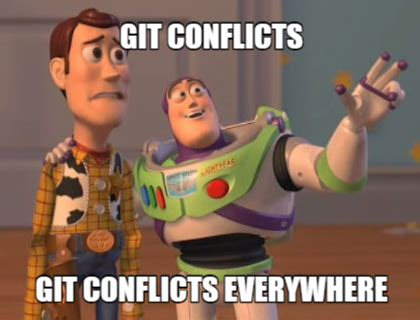

```{r setup, include=FALSE}
options(htmltools.dir.version = FALSE)
knitr::opts_chunk$set(
  fig.width = 9, fig.height = 3.5, fig.retina = 3, 
  out.width = "100%",
  cache = FALSE,
  echo = TRUE,
  message = FALSE, 
  warning = FALSE,
  hiline = TRUE
)
```

```{r xaringan-themer, include=FALSE, warning=FALSE}
library(xaringanthemer)
xaringanthemer::style_mono_accent(base_color = "#1381B0",
white_color = "#FFFFFF",
  header_font_google = google_font("Roboto Condensed"),
  text_font_google   = google_font("Roboto Condensed", "300", "300i"),
  code_font_google   = google_font("Ubuntu Mono"), text_font_size = "30px"
)
```

# Hoje 

+ Estrutura de um projeto de análise de dados (10min)
+ O que é controle de versões, o que é git, o que é GitHub? (20min)
+ Funcionamento básico de git no computador (30min)
+ Conectando com o remoto e fazendo push para GitHub (30min)

# Na sexta

+ Tura dúvidas de terça
+ Trabalhando com múltiplos remotos (GEE e GitHub) (20 min)
+ Colaboração online usando GitHub (40 min)

---
class:middle, center, inverse
# Estrutura de um projeto de análise de dados

---
## um projeto de análise de dados

+ uma única pasta 

--

+ subpastas para o código, os documentos, as figuras, os dados, os resultados

--

+ dados crus não se modificam, dados modificados são salvos

--

+ documentação: README, metadados, código comentado

---
## um projeto de análise de dados

```{r, eval = F}
project/
    ├── data/ #<<
    ├── docs/
    ├── figs/
    ├── scripts/
    ├── output/
    └── README.md
```

+ __data/__ dados brutos separados de processados, explicita e corretamente nomeados (`dados_raw.csv`, `dados_processed.csv`)

---
## um projeto de análise de dados

```{r, eval = F}
project/
    ├── data/
    ├── docs/ #<<
    ├── figs/
    ├── scripts/
    ├── output/
    └── README.md
```

+ __docs/__ arquivos em .pdf, .doc, .docx, suplementares. não são arquivos de texto. 

+ em alguns projetos, é aí que a página web é criada

---
## um projeto de análise de dados

```{r, eval = F}
project/
    ├── data/
    ├── docs/
    ├── figs/ #<<
    ├── scripts/
    ├── output/
    └── README.md
```

+ __figs/__ figuras suplementares (não geradas por código)

---
## um projeto de análise de dados

```{r, eval = F}
project/
    ├── data/
    ├── docs/
    ├── figs/
    ├── scripts/ #<<
    ├── output/
    └── README.md
```

+ __scripts/__ scripts de GEE, R, organizados, idealmente numerados para a gente saber a ordem de execução sem ter que ir para a documentação (ex. `00_data_setup.R`, `01_data_cleaning.R`)

---
## um projeto de análise de dados

```{r, eval = F}
project/
    ├── data/
    ├── docs/
    ├── figs/
    ├── scripts/
    ├── output/ #<<
    └── README.md
```

+ __output/__ output dos scripts, organizado, idealmente numerado, idealmente seguindo a mesma numeração dos scripts para referência (ex. `00a_data.csv`, `00b_clean_data.csv`)

---
## um projeto de análise de dados

```{r, eval = F}
project/
    ├── data/
    ├── docs/
    ├── figs/
    ├── scripts/
    ├── output/
    └── README.md #<<
```

+ __README.md__ um arquivo explicando toda a estrutura do projeto, idealmente indicando mudanças marcadas com a data, constantemente atualizado.

+ __metadados!__ quando possível


---
class:middle, center, inverse
# Controle de versões 
 
---
## controle de versões


```{r, eval = F}
project/
    ├── data/
    ├── docs/
    ├── figs/
    ├── scripts/
        └── script.R  #<<
    ├── output/
    └── README.md
```

---
## controle de versões

```{r, eval = F}
project/
    ├── data/
    ├── docs/
    ├── figs/
    ├── scripts/
        └── script.R  #<<
    ├── output/
        └── resultado.csv  #<<
    └── README.md
```

---
## controle de versões

```{r, eval = F}
project/
    ├── data/
    ├── docs/
    ├── figs/
    ├── scripts/
        └── 220523script.R  #<<
        └── 230523script.R  #<<
    ├── output/
        └── resultado.csv  #<<
        └── resultado2.csv  #<<
    └── README.md
```

---
## controle de versões

```{r, eval = F}
project/
    ├── data/
    ├── docs/
    ├── figs/
    ├── scripts/
        └── 2205223script_old.R  #<<
        └── 230523script_modificado.R  #<<
    ├── output/
        └── resultado_apagar?.csv #<<  
        └── resultado2.csv  
        └── resultado_final.csv  #<<
    └── README.md
```

---
## controle de versões

```{r, eval = F}
project/
    ├── data/
    ├── docs/
    ├── figs/
    ├── old_apagar/ #<< 
    ├── scripts/
        └── 240523_script.R  #<<
    ├── output/
        └── resultado_final.csv  #<<
        └── 240523_resultado_final.csv  #<<
        └── 240523_resultado_final_agora_sim.csv  #<<
    └── README.md
```

--

## trabalhar assim (só ou em equipe!) é confuso, pode levar a erros, dificulta a colaboração...


---
background-image:url("./figs/phdcomics.gif")
background-size: 40%
---
## assim...

+ qual a diferença entre `resultados_1.csv` e `resultados_2.csv`?

+ a data `240523_script.R` diz respeito à criação do script? à última modificação? 

+ algum arquivo foi apagado? algum trecho de código sumiu? 

<center>

```{r, echo = F, out.width=250}
knitr::include_graphics("https://media.giphy.com/media/JIX9t2j0ZTN9S/giphy.gif")
```

</center>

---
## controle de versões

+ sistemas que permitem: 

--

  + registrar mudanças ao longo do tempo

--

  + voltar atrás se houver algum erro

--

  + entender a diferença entre uma versão e outra do mesmo arquivo

--

  + colaborar: __compartilhar__ as análises e __trabalhar em equipe__ 
  
---

```{r, echo = F, eval = T, out.width=150}
knitr::include_graphics("./figs/logo-git.png")
```
+ um programa de software livre, instalado no seu computador 

--

+ um projeto == um __repositório__

--

+ distribuído (ninguém tem uma "cópia principal"): __clones/forks__  e ramificações (__branches__) 

--

+ controla detalhadamente o conteúdo de __arquivos de texto__: `.txt`, `.csv`, `.md`, `.R`

--

+ pode incluir outro tipo de arquivos (binários) mas não vai mostrar as diferenças

--

+ o usuário decide __quais arquivos__ _adicionar_ e quais _ignorar_ (pastas extra, arquivos grandes, testes locais...)

--

+ o usuário decide __quando__ incluir e salvar uma versão ("__fazer um commit__") (não é "update contínuo" como Dropbox e similares). Um projeto == uma sequência de _commits_

--

+ serve __localmente__ e __offline__. __servidores remotos__ podem ser adicionados como _backup_ e para distribuir/colaborar


---
```{r, echo = F, eval = T, out.width=150}
knitr::include_graphics("./figs/GitHub_Logo.png")
knitr::include_graphics("./figs/gitlab-logo-gray-rgb.png")
knitr::include_graphics("./figs/btibucket.png")
```

+ __hospedagem web__ para repositórios de git (__"remotos"__)

--

+ pertencem a empresas. criam ferramentas para facilitar a colaboração (__Vamos testar!__)

--

+ projetos e empresas podem fazer configuração do próprio servidor remoto e não usar GitHub e similares: __GEE "é" seu próprio remoto, com as regras que eles decidem__

--

+ também pode haver mais de um remoto para o projeto local (por exemplo: trabalhando no GEE, GEE é o remoto principal `origin` e a gente adiciona um segundo remoto que a gente chama `github`)

--

+ ao trabalhar com remotos você faz __pull__ para chamar o conteúdo remoto e dá __push__ para empurrar as mudanças.


---
# A gente precisa

+ Ver o funcionamento básico de git localmente 

+ Conectar com GitHub como remoto e "empurrar" conteúdo para GitHub

+ Testar a colaboração online em GitHub

+ Testar o uso de remotos múltiples ao trabalhar com GEE


---
## os comandos básicos de git (__terminal__)

### localmente
`git init` inicia um repositório   

--


`git status` checa em que pé está

--

`git add {filename}` adiciona um arquivo novo ou mudanças a arquivos monitorados

--

`git commit -m "uma mensagem informativa"` __cria um commit__

## Vamos fazer :)

https://hackmd.io/@andreasancheztapia/workshop_git/edit

---
### usando remotos

`git clone URL` clona um repositório já existente

--

`git remote -v` vê os remotos

--

`git remote add origin [URL]` adiciona remoto e dá o nome `origin` (se não tiver)

--

`git pull origin main` atualiza o repo localmente (nem sempre aconteceu algo remotamente mas é muito melhor checar sempre)

--

Trabalha normal (`git add`, `git commit`)

--

`git push origin main` - manda os _commits_ locais para o remoto origin, branch main

+ `origin` é o nome do remoto
+ `main` é o nome do branch. antes era `master` e GEE ainda usa `master`

---
## fluxo de trabalho - Primeira vez

`git init`  
--

`git remote add`  
--

`(...)`  
--

`git add arquivo1 (novo)`  
--

`(...)`  
--

`git add arquivo2 (novo)`  
--

`git commit`  
--

`(...)`  
--

`git add arquivo1 (modificado)`  
--

`(...)`  
--

`git add arquivo3 (novo)`  
--

`git commit`  
--

`git push -u`  

---

## as vezes seguintes

`git pull origin main` (__essencial__)   
--

`(...)`  
--

`git add arquivo4`  
`git add arquivo2 (modificado)`  
`etc.`  
--

`git commit`  
--

`git push origin main`  

---
## dicas gerais


+ GitHub __não é uma nuvem__ para _backup_ de arquivos
--

+ controlar apenas __arquivos de texto__ (texto simples ou código)
--

+ usar o arquivo `.gitignore` para que o git ignore arquivos que não serão controlados e existem só localmente no seu computador

---
## `.gitignore`

+ __Git só vai controlar o que você adicionar__
--

+ __Não é preciso adicionar tudo__ (rascunhos, testes, arquivos binários): o arquivo `.gitignore`
--

+ __Arquivos muito grandes__ (*.tiff) vão esgotar o limite do repositório (2G GitHub e Bitbucket, 10G em GitLab)
--

+ Arquivos binários (*.pdf, +.docx) até podem ser adicionados mas ocupam espaço e __git não entende modificações detalhadas__
--

+ aceita expressões gerais:
  `*.pdf`
  `/docs`
  `*.docx`
  `*.xlsx`
  

---
## trabalhando com _branches_

+ um usuário pode trabalhar em vários _branches_

+ vários usuários podem trabalhar em um repositório mas em _branches_ diferentes

+ cada usuário pode ter uma cópia própria do repositório inteiro ("_fork_") e mesmo assim colaborar - `merge` e `pull request` de GitHub

---
## git pode ser complicado



---
background-image: url(./figs/xkcd.png)
background-position: 90%, 50%
## conflitos 

+ resolve manualmente

+ desfaz um ou vários _commits_

+ faz um clone do zero e corrige os erros


---
## boas práticas

1. descrever no commit (o porquê da) mudança

1. trabalhar uma tarefa em cada _branch_

1. usar `.gitignore` para ignorar alguns arquivos que não devem ser monitorados (ex. arquivos do sistema)

1. usar modo `diff` para acompanhar mudanças no código

1. reportar erros no código em `issues` no GitHub


---

## mais referências

+ Getting started with Git and GitHub for R users https://saghirb.github.io/shared/Getting-Started-with-Git-and-GitHub-for-R-Users.html#1

+ A página oficial de git e o tutorial oficial https://git-scm.com/doc/ext
, https://git-scm.com/docs/gittutorial

+ Livro Pro Git https://git-scm.com/book/es/v1

+ Jenny Bryan - Happy Git and GitHub for the useR https://happygitwithr.com/